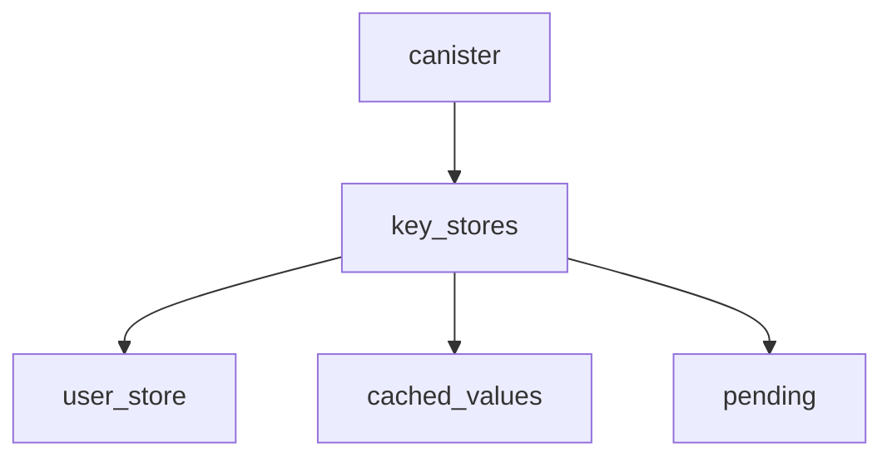
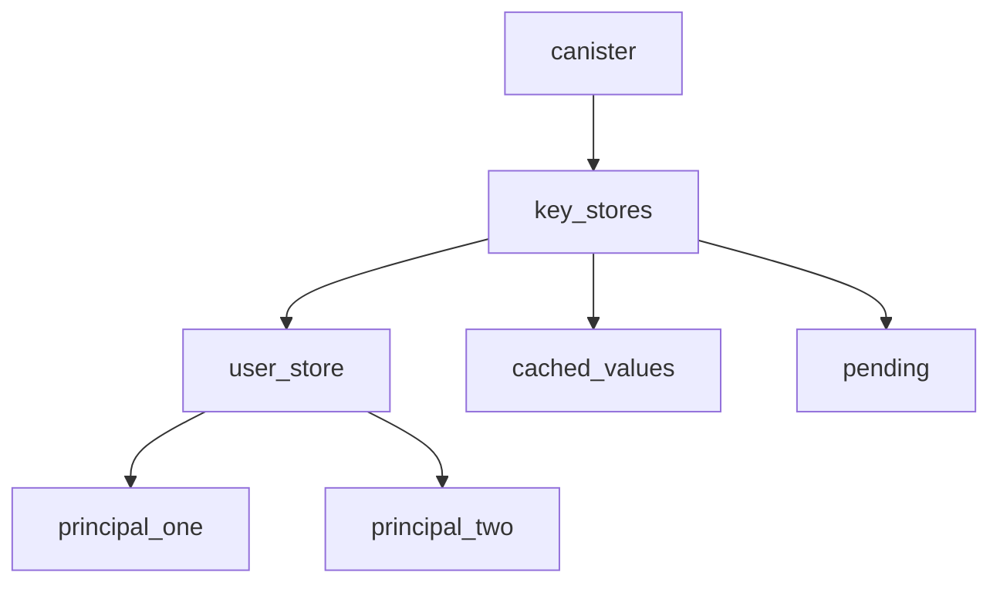
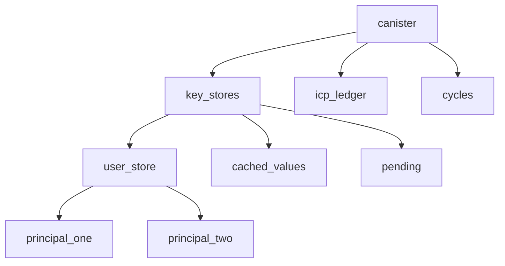
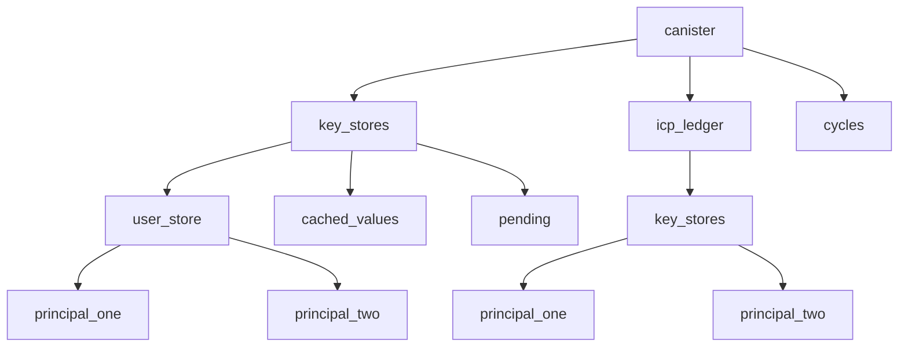

# Departure Labs DLIP 3 | Resource Authorization

```
version : v0
interface_identifier : DL::DLIP_3v0
authors : Hazel Rowell,
```

## Summary
This is a standard describing a simple resource based authorization system for use in canisters on the Internet Computer

## Policy Types

### Policy
A `Policy` is a set of rules, represented as a list of `Statement` objects, used to determine whether a `Request` should be authorized or not. Each `Statement` has an `Effect` which specifies whether the statement allows or denies access to a particular resource. When multiple statements apply to the same Request, the policy **must** select the `Effect` from the __least permissive statement__.

```rust
pub struct Policy {
    statements: Vec<Statement>,
}
```

### Request

A `Request` represents a request for access to a particular resource. It contains the following fields:

- `action`: a string representing the action being requested (e.g. "read", "write", "delete").
- `resource`: a string representing the name of the resource being accessed.
- `caller`: an Identity representing the identity of the user, group, or service that is requesting access to the resource.

To determine whether a `Request` should be authorized or not, the `Policy` evaluates each `Statement` in the statements list. If the `Request` matches a particular `Statement`, the `Effect` of that statement is used to determine whether the `Request` should be allowed or denied.

By using a `Policy` and a `Request` together, this authorization system can evaluate whether a particular request should be authorized or not based on the rules set forth in the `Policy`.

### `Statement`

A `Statement` represents a single authorization rule consisting of the following fields:

- `effect`: an Effect that specifies whether access to the
resources specified in this rule is allowed or denied.
- `identities`: a list of `StatementIdentity` objects that specify the identities to which this rule applies.
- `operations`: a list of strings representing the operations that this rule applies to (e.g. "read", "write", "delete").
- `resources`: a list of `StatementResource` objects representing the resources to which this rule applies.

```rust
pub struct Statement {
    effect: Effect,
    identities: Vec<StatementIdentity>,
    operations: Vec<String>,
    resources: Vec<StatementResource>,
}
```

### `Effect`

An `Effect` specifies whether access to the resources specified in a rule is allowed or denied.

```
pub enum Effect {
    Allow,
    Deny,
}
```

### `Identity`

An `Identity` represents a specific identity that can be authorized to access a resource.

```rust
#[derive(Serialize, Deserialize)]
pub enum Identity {
    Principal(Principal),
}
```

### `StatementIdentity`

A `StatementIdentity` represents an identity to which a rule applies. It can be either a specific Identity or the wildcard Any, which matches any identity.


```rust
pub enum StatementIdentity {
    Identity(Identity),
    Any,
}
```

### `StatementResource`

A `StatementResource` represents a resource to which a rule applies. It can be either a specific resource identified by its string name, nested resources, or the wildcard Any, which matches any resource.

```rust
pub enum StatementResource {
    Resource(String),
    Nested(Vec<StatementResource>)
    Any,
}
```

For example, a canister method pair can be a resource. The resource string can be constructed by concatenating the name of the canister with the name of the method, separated by a dot (e.g. my_canister.my_method). In this case, the method represents an action that can be performed on the canister.

Another example of a resource might be an internal Key Value store, which can be used by a canister to store and retrieve data. The name of the Key Value store can be used as the resource string (e.g. my_key_value_store). More granular control could be achieved by concatenating the store name with the value name (e.g. my_key_value_store.my_special_value).

### Best Practices

#### Use a hierarchy

Use resource naming to develop a hierarchy within your policy statements. For example, if you have a canister with multiple key-value stores, you might choose to identify them like `canister.key_stores.user_store`, `canister.key_stores.cached_values`, and `canister.key_stores.pending`.



As you expand your permission system you can insert nodes where needed

Adding more granularity to a specific resource


Eventually, adding additional resources


Maybe, reusing building blocks in other parts of the hierarchy



